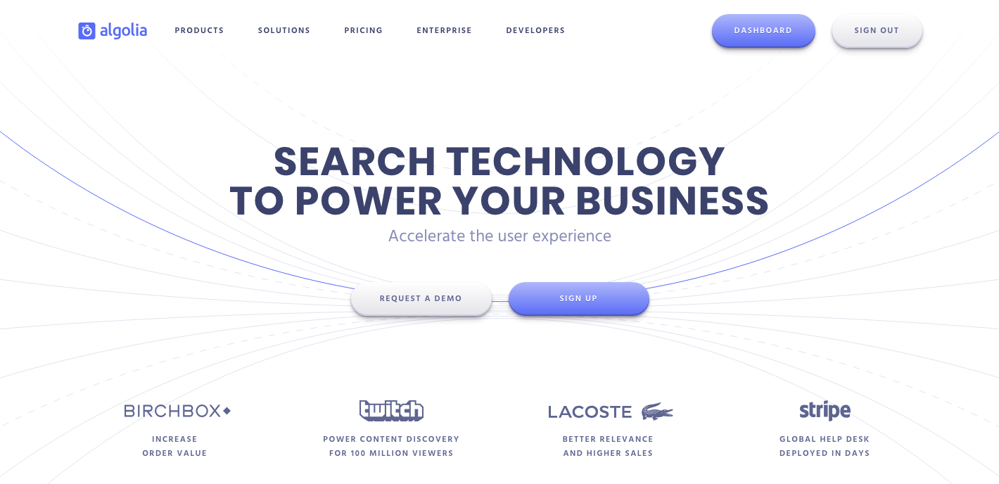
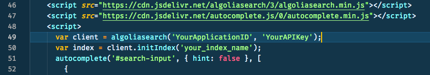
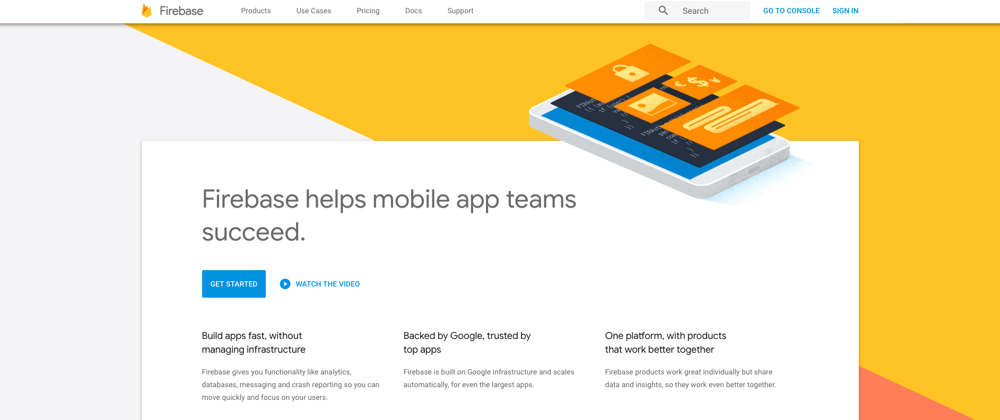
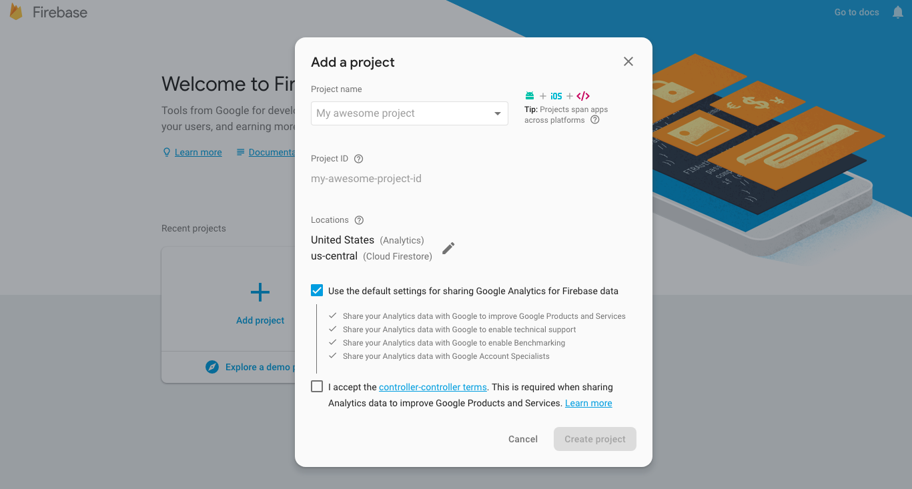
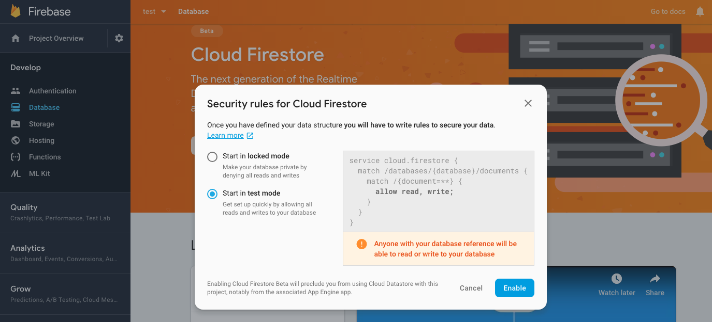
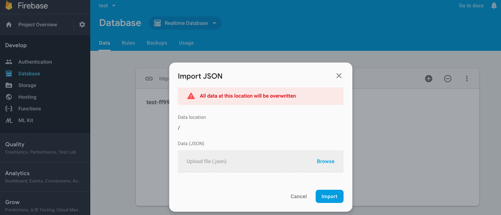
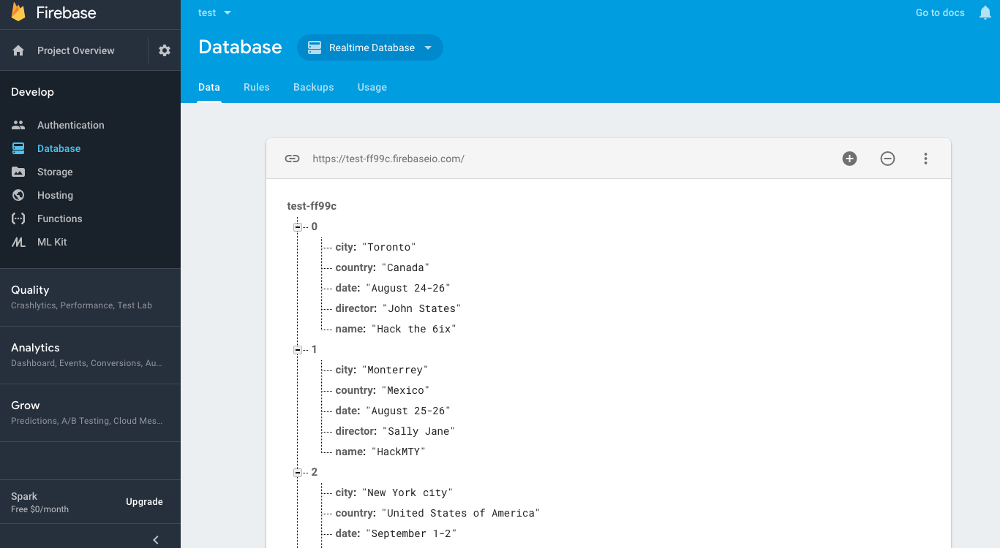
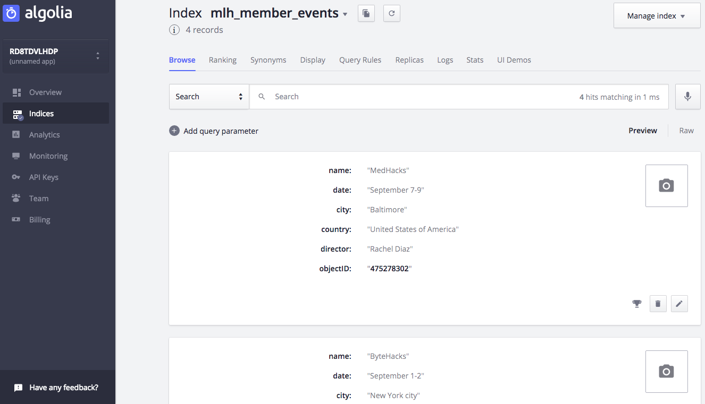

# Creating a simple search app in 30 minutes using Algolia and Firebase

> Learn how to search in minutes!

Search is a critical part of the modern web.  There are countless ways to use it, but there's no need to reinvent the wheel when it comes to building this functionality into your website or web app.  There are some awesome APIs (in other words, services) out there that will help you focus on writing your code instead of worrying about search!  Today I'm going to show you how to use [**Algolia**](https://www.algolia.com/) and [**Firebase**](https://firebase.google.com/) to create a simple search application.

Here's the Algolia home page!  As we can see, it's used by some pretty big companies.  For the sake of this tutorial, we're going to be focusing on creating a simple website that will use the Algolia API for search.

## Setup

### 0.  Sign up for an Algolia account
- Follow [**this link**](https://www.algolia.com/users/sign_up) to create your Algolia account!

Algolia offers a completely free account in their Community tier.  This is great because you're able to get full API functionality for development purposes without incurring any cost!  There is no credit card required to get started.

### 1.  Find your API credentials
After successfully creating your account, click on ***API Keys*** in the left-hand column of your dashboard to find your API credentials.  You'll need them in a few minutes!  These credentials are sent along with your search requests in order to tell the Algolia servers which developer account the activity is associated with.

*Note:  Your Admin API Key is secret!  Don't share it publicly or post it online.*

## Getting Started

### 2.  Create an index.html file
- Go to [this link](PLACEHOLDER) to download the example ***index.html*** file needed to create our search page or copy and paste it from here:

> <!DOCTYPE html>
> <html>
>   <head>
>     <link rel="stylesheet" href="https://maxcdn.bootstrapcdn.com/bootstrap/3.3.5/css/bootstrap.min.css">
>     
>   </head>
>   <body>
>     

>       

>         

>           <form action="#" class="form">
>             <h3>Algolia API Tutorial</h3>
>             <input class="form-control" id="search-input" name="contacts" type="text" placeholder='Search for events...' />
>           </form>
>         

>       

>     

>
>     
>     
>     
>   </body>
> </html>

### 3.  Insert your API credentials
- Grab the API credentials from the ***API Keys*** section of your Algolia dashboard and insert them into the appropriate spots in the code (`YourApplicationID` and `YourAPIKey`).

- Save the ***index.html*** file.

### 4.  Testing it out
You can create a new [**GitHub**](https://github.com/) repository, upload your ***index.html*** file to it and enable GitHub Pages to create a website from it.  An even easier way to test is to use [**CodePen**](https://codepen.io/) by creating a new pen and pasting in the contents of your ***index.html*** file.

If all went well, you should see a page similar to the following!

## Connecting Firebase

### 5.  Sign up for a Firebase account
- Follow [this link](https://console.firebase.google.com/) to create your Firebase account!

*Note:  Your Firebase account is tied to your Google account, so if you already have a Google account you can sign in with it.*

Firebase offers a completely free account for development and testing purposes.  That's what we'll use for this tutorial.  Again, no credit card is required to get started.

### 6.  Create a new Firebase Application
- Click the ***Add project*** button in your Firebase dashboard.
- Enter a name for it.
- Click the ***Create project*** button.

### 7.  Create a new database
- Click on ***Database*** in the left-hand column of your project dashboard.
- Click on the ***Create database*** button.  
- Choose the radio button to ***Start in test mode***.
- Click the ***Enable*** button.

### 8.  Add your data
- Go to [this link](PLACEHOLDER) to download the example ***mlh_member_events.json*** file needed to create our database or copy and paste it from here:

> [
> 	{
> 		"name":"Hack the 6ix",
> 		"date": "August 24-26",
> 		"city": "Toronto",
> 		"country": "Canada",
> 		"director": "John States"
> 	},
> 	{
> 		"name":"HackMTY",
> 		"date": "August 25-26", 
> 		"city": "Monterrey",
> 		"country": "Mexico",
> 		"director": "Sally Jane"
> 	},
> 	{
> 		"name":"ByteHacks",
> 		"date": "September 1-2", 
> 		"city": "New York city",
> 		"country": "United States of America",
> 		"director": "Jack Doe" 
> 	},
> 	{
> 		"name":"MedHacks",
> 		"date": "September 7-9",
> 		"city": "Baltimore",
> 		"country": "United States of America",
> 		"director": "Rachel Diaz"
> 	}
> ]

- Click on the dropdown next to ***Database*** and choose the ***Realtime Database*** option.
- Click on the ***more*** button (the vertical ellipsis).
- Click on ***Import JSON***.
- Browse to the example JSON file you downloaded and click the ***Import*** button.

- Click on the ***Expand data*** button (the plus symbol).

If all went well, you should see the example data imported into your database similar to the following!

### 9.  Create a Node.js application
*Note:  If you haven't used Node.js before, go to [**this link**](https://nodejs.org/en/download/) to install it on your system.*

- Create a new folder.
- Run `npm init` from the command line inside of the new folder.
- Accept the defaults in the wizard (just keep pressing ***Enter***) to create a ***package.json*** file.
- Run `npm install dotenv algoliasearch firebase --save` from the command line inside of the new folder.

### 10.  Configure your environment
- Go to [this link](PLACEHOLDER) to download the example ***.env*** file needed to set up our environment or copy and paste it from here:

> ALGOLIA_APP_ID=<algolia-app-id>
> ALGOLIA_API_KEY=<algolia-api-key>
> ALGOLIA_INDEX_NAME='algolia-index-name'
> FIREBASE_DATABASE_URL=https://<my-firebase-database>.firebaseio.com

- Insert your Algolia API credentials, Algolia index name and Firebase database URL into this file.
- Save this file into the same folder that you ran the `npm init` command in.

### 11.  Create a main index.js file
- Go to [this link](PLACEHOLDER) to download the example ***index.js*** file needed for our Node.js application or copy and paste it from here:

> const algoliasearch = require('algoliasearch');
> const dotenv = require('dotenv');
> const firebase = require('firebase');
>
> // load values from the .env file in this directory into process.env
> dotenv.load();
>
> // configure firebase
> firebase.initializeApp({
>   databaseURL: process.env.FIREBASE_DATABASE_URL,
> });
> const database = firebase.database();
>
> // configure algolia
> const algolia = algoliasearch(
>   process.env.ALGOLIA_APP_ID,
>   process.env.ALGOLIA_API_KEY
> );
> const index = algolia.initIndex(process.env.ALGOLIA_INDEX_NAME);
>
> // Get all contacts from Firebase
> database.ref('/my-firebase-database').once('value', my-firebase-database => {
>   // Build an array of all records to push to Algolia
>   const records = [];
>   contacts.forEach(contact => {
>     // get the key and data from the snapshot
>     const childKey = contact.key;
>     const childData = contact.val();
>     // We set the Algolia objectID as the Firebase .key
>     childData.objectID = childKey;
>     // Add object for indexing
>     records.push(childData);
>   });
>
>   // Add or update new objects
>   index
>     .saveObjects(records)
>     .then(() => {
>       console.log('Contacts imported into Algolia');
>     })
>     .catch(error => {
>       console.error('Error when importing contact into Algolia', error);
>       process.exit(1);
>     });
> });

- Replace the two instances of `my-firebase-database` with the name of your Firebase database.
- Save this file into the same folder that you ran the `npm init` command in.
- Run `node index.js` from the command line inside of the same folder.

### 12.  Verify the synchronization
- Click on ***Indices*** in the left-hand column on your Algolia dashboard.

If all went well, you should see the example data from Firebase synchronized similar to the following!

### 13.  Test the search
- Load your GitHub Page or your CodePen Pen that you created earlier.
- Try typing in the search box.

If all went well, you should see results from the example data similar to the following!

Congratulations!  You've built a simple search page using the Algolia API with Firebase as your database.  

I hope you enjoyed this tutorial on using [**Algolia**](https://www.algolia.com/)'s API to power search in your website.

The full source code is [**available on GitHub here**](https://github.com/th3str4p/algolia-api-tutorial)!